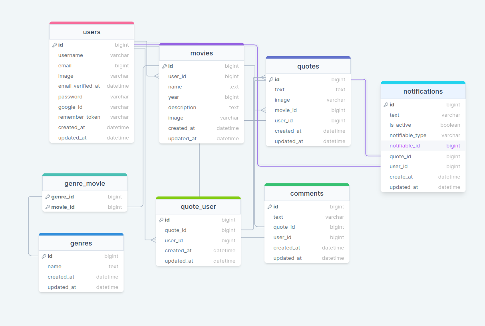

<div style="display:flex; align-items: center; justify-content:center">
  <h1 >Movie Quotes API</h1>
</div>

---

Movie Quotes is a social network app where people can post quotes from movies and in news feed everybody is able so check other peoples posts, people can comment and like each others posts.

#

### Table of Contents

-   [Prerequisites](#prerequisites)
-   [Tech Stack](#tech-stack)
-   [Getting Started](#getting-started)
-   [Migrations](#migration)
-   [Development](#development)
-   [DrawSQL](#drawsql)

#

### Prerequisites

-    *PHP@8.2 and up*
-    _npm@9.4 and up\_
-    _composer@2.5 and up\_

#

### Tech Stack

-    [Laravel@10.x](https://laravel.com/docs/10.x)
-    [Spatie Translatable](https://github.com/spatie/laravel-translatable)
-    [Laravel Echo](https://github.com/laravel/echo)

#

### Getting Started

1\. First of all you need to clone Coronatime repository from github:

```sh
git clone https://github.com/RedberryInternship/davit-gagua-epic-movie-quotes-back.git
```

2\. Next step requires you to run _composer install_ in order to install all the dependencies.

```sh
composer install
```

3\. Now we need to set our env file. Go to the root of your project and execute this command.

```sh
cp .env.example .env
```

And now you should provide **.env** file all the necessary environment variables: <br>

#

after setting up **.env** file, execute:

```sh
  php artisan key:generate
```

##### Now, you should be good to go!

#

### Migration

if you've completed getting started section, then migrating database if fairly simple process, just execute:

```sh
php artisan migrate --seed
```

#

### Development

You can run Laravel's built-in development server by executing:

```sh
  php artisan serve
```

### DrawSQL

Also, Check out tables for Movie Quotes app.


